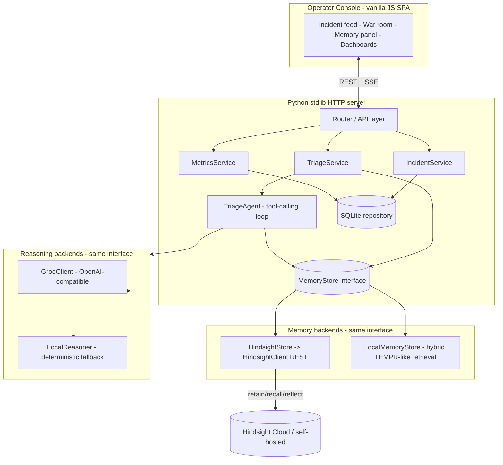
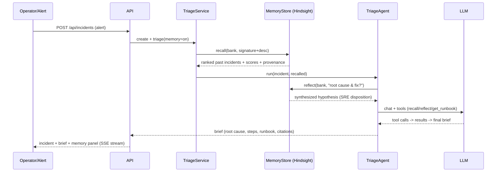

# Architecture — Muninn

**One-line:** an incident-triage agent whose memory layer (Hindsight) is the product.
Clean layered Python backend + dependency-free SPA, designed to run offline and to
swap in real Hindsight/Groq the moment credentials exist.

---

## 1. C4-ish component view



## 2. Request lifecycle (new alert)



## 3. How Hindsight is used (the core)

Muninn maps the incident domain onto Hindsight's memory model faithfully:

| Hindsight concept | Muninn usage |
|---|---|
| **Memory bank** | One bank per environment (`muninn-incidents`), isolating org knowledge. Bank `mission` steers extraction toward services, error classes, root causes, and fixes; `disposition` = a calm, senior SRE. |
| **retain** | Every historical and newly-resolved incident is retained as a rich document (symptoms, logs, root cause, remediation, outcome, MTTR). Runbooks/services retained as `world` facts; incidents as `experience`; operator-confirmed learnings as `observation`. |
| **recall** | On a new alert the signature + description is used to recall the top-k most relevant past incidents. TEMPR (semantic + keyword + graph + temporal) surfaces matches even when wording differs. Scores + provenance are shown in the UI. |
| **reflect** | The agent asks the bank to *reason*: "Given past incidents like this, what is the most likely root cause and the fastest safe fix?" Reflect synthesizes across memories using the bank's SRE disposition — this is the "it has seen this before" moment. |

**Before/after:** with memory OFF the agent only has the alert; with memory ON it has
recalled incidents + a reflected hypothesis. The UI shows both side by side.

**Learning loop:** resolve → retain outcome → next similar alert recalls it →
confidence & retrieval coverage rise. This is visualized as the learning curve.

## 4. Abstraction seams (why it degrades gracefully)

Two interfaces make external services optional without faking success:

- `MemoryStore` (`backend/memory/base.py`) — implemented by `HindsightStore`
  (real REST client) and `LocalMemoryStore` (in-process hybrid retriever that mirrors
  TEMPR: char/word n-gram cosine + BM25 keyword + temporal recency + entity overlap,
  fused and reranked). Selected at startup by config; the active backend is reported
  to the UI via `/api/health`.
- `Reasoner` (`backend/llm/client.py`) — implemented by `GroqClient` (OpenAI-compatible
  chat + tool calls) and `LocalReasoner` (deterministic, template + retrieved-evidence
  synthesis). The agent loop is identical for both.

This is honest engineering: the real integrations are first-class code paths; the
fallbacks let the app run and be tested anywhere, and the UI never lets a simulated
result masquerade as a live one.

## 5. Module layout

```
backend/
  server.py            # ThreadingHTTPServer entrypoint; serves API + SPA
  router.py            # tiny regex router, JSON + SSE helpers
  config.py            # env-driven settings (.env supported)
  db.py                # sqlite schema + connection helpers
  models.py            # dataclasses: Incident, Memory, Brief, Service, Runbook
  memory/
    base.py            # MemoryStore ABC + Memory/RecallResult types
    hindsight_client.py# faithful REST client (retain/recall/reflect/create_bank)
    hindsight_store.py # MemoryStore over HindsightClient
    local_store.py     # offline hybrid retriever (TEMPR-like)
    retrieval.py       # embeddings, bm25, fusion, scoring
  llm/
    client.py          # Reasoner interface, GroqClient, LocalReasoner
    agent.py           # TriageAgent tool-calling loop (+ error handling)
    tools.py           # tool schema + dispatch
    prompts.py         # system prompts / disposition
  services/
    incidents.py       # lifecycle + persistence
    triage.py          # recall + reflect + agent orchestration
    metrics.py         # MTTR, learning curve, coverage
  api/routes.py        # endpoint handlers
  static/              # index.html, app.js, styles.css, assets/
data/                  # synthetic dataset + generator + seeder
tests/                 # unittest suite
scripts/demo.py        # CLI end-to-end learning-curve demo
```

## 6. Key decisions & trade-offs
- **Stdlib-only core** over a framework: zero-install, instantly runnable by judges,
  fully testable in any sandbox; the cost (no framework niceties) is paid down with a
  small, well-tested router.
- **Two interchangeable backends** over hard dependencies: reliability and honesty.
- **SQLite** for structured incident state; **Hindsight** for semantic memory — each
  used for what it is best at (system-of-record vs. memory/retrieval).
- **SSE** over WebSockets for streaming: simpler, proxy-friendly, stdlib-native.

